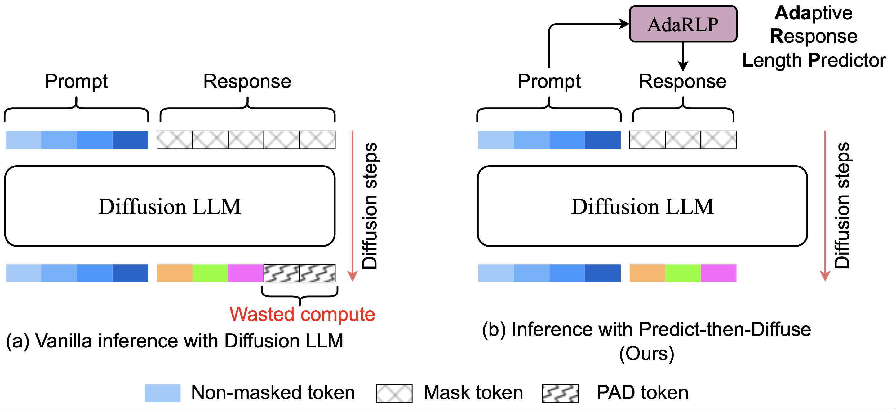

# Predict-Then-Diffuse


## Abstract

Diffusion-based Large Language Models (D-LLMs) represent a promising frontier in generative AI, offering fully parallel token generation that can lead to significant throughput advantages and superior GPU utilization over the traditional autoregressive paradigm. However, this parallelism is constrained by the requirement of a fixed-size response length prior to generation. This architectural limitation imposes a severe trade-off: oversized response length results in computational waste on semantically meaningless padding tokens, while undersized response length cause output truncation requiring costly re-computations that introduce unpredictable latency spikes. To tackle this issue, we propose Predict-Then-Diffuse, a simple and model-agnostic framework that enables compute-budgeted inference per input query by first estimating the response length and then using it to run inference with D-LLM. At its core lies an Adaptive Response Length Predictor (AdaRLP), which estimates the optimal response length given an input query. As a measure against under-estimating the response length and re-running inference with a higher value, we introduce a data-driven safety mechanism based on a small increase of the predicted length. As a whole, our framework avoids that computation is wasted on padding tokens, at the same time preserving output quality. Experimental validation on multiple datasets demonstrates that Predict-Then-Diffuse reduces computational costs (FLOP) significantly compared to the default D-LLM inference mechanism, while being robust to skewed data distributions.



## Overview

This repository contains two notebooks:

- length predictor model training and performance analysis + analytical simulation for the predict-then-diffuse setup
- empirical profiling for generation cost (FLOPs, GPU time, VRAM)

## Repository Contents

- `ptd_analytical_simulation.ipynb`
	- length prediction model training and performance analysis
	- analytical and simulation-side experiments
	- produces predicted length artifacts used by profiling
- `ptd_empirical_profiling_comparison.ipynb`
	- empirical profiling and comparison runs
	- includes baseline vs fallback/fixed length-profile experiments
- `data/predicted_lengths.csv`
	- baseline predicted lengths
- `data/predicted_lengths_with_fallback.csv`
	- fallback-expanded predicted lengths
- `data/predicted_lengths_fixed.csv`
	- fixed/cleaned fallback lengths
- `pyproject.toml`
	- project dependencies managed with `uv`

## Requirements

- Python 3.13+
- `uv` installed
- NVIDIA GPU (recommended for profiling cells)

Some profiling cells use optional packages not pinned in `pyproject.toml` (for example `deepspeed`).

## Setup

From the repository root:

```bash
uv sync
```

If you need optional profiling dependencies used in specific notebook cells:

```bash
uv add deepspeed
```

## How To Run

## 1) Analytical Simulation

Open `ptd_analytical_simulation.ipynb` and run cells top-to-bottom.

This notebook is the best place to:

- train and evaluate the length predictor
- build/inspect the analytical setup
- generate or validate length prediction artifacts

## 2) Empirical Profiling

Open `ptd_empirical_profiling_comparison.ipynb` and run cells top-to-bottom.

The final profiling sections compare multiple input policies:

- Experiment A: `predicted_lengths.csv` (baseline)
- Experiment B: `predicted_lengths_fallback.csv` (legacy fallback variant, if present)
- Experiment C: `predicted_lengths_fixed.csv` (current fixed length variant)


## Notes

- Notebook output can depend on GPU memory and driver/toolkit versions.
- If a CSV file is reported missing, run the analytical notebook first or place the required file under `data/`.
- If the model download is slow/fails, rerun after network/auth checks for your Hugging Face environment.
